# 우산대여 프로젝트: 비피

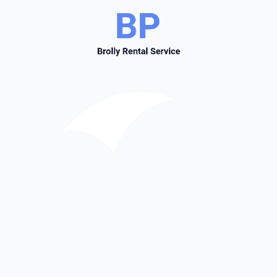

 

## 프로젝트 소개
**우산대여 프로젝트: 비피**는 웹IoT 프로젝트로, 가상의 우산대여 시스템의 설계 및 구현, 키오스크 제작까지에 대해 어떤 기능이 필요할지 요구사항을 추려내고, 해당 요구사항에 따라 기능을 구현한 **개발진의 역량향상** 프로젝트입니다.

크게 웹 Front-end, Back-end, IoT 파트로 나누어, 7주동안 프로젝트를 진행했습니다.

- 2023.02.17. 삼성청년소프트웨어아카데미(SSAFY) 8기 2학기 공통프로젝트 구미캠퍼스 1반 1등

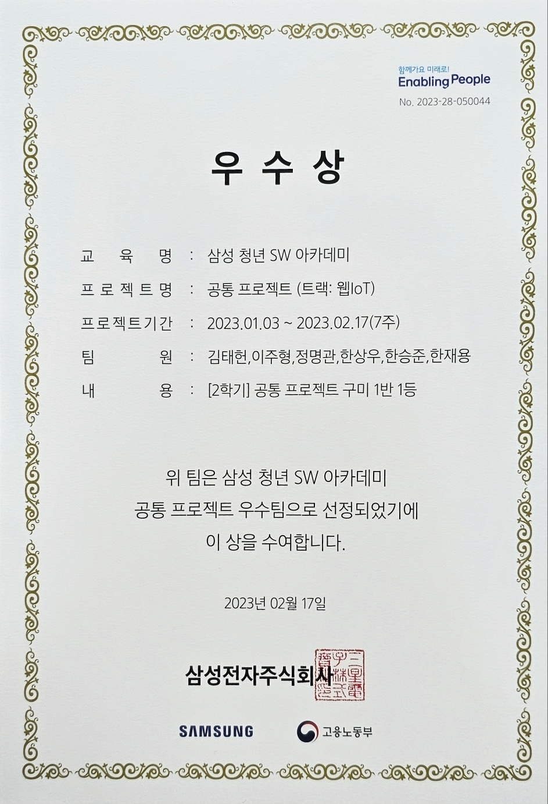

 

## 목차
- [참여자](#참여자)
- [발표자료](#발표자료)
- [UCC](#UCC)
- [기간](#기간)
- [기능구현](#기능구현)
- [사용기술스택](#사용기술스택)
- [스크린샷](#스크린샷)

 

## 참여자

### Back-end

| 한재용([@rigizer](https://github.com/rigizer)) | 정명관([@rhalsemd](https://github.com/rhalsemd)) | 한상우([@miracle3070](https://github.com/miracle3070)) |
|:----:|:----:|:----:|
||||

 

### Front-end

| 이주형([@22JH](https://github.com/22JH)) | 한승준([@hanseungjune](https://github.com/hanseungjune)) | 김태헌([@gangnamssal](https://github.com/gangnamssal)) |
|:----:|:----:|:----:|
||||

 

## 발표자료
[다운로드](data/공통PJT_구미_1반_D104_비피.pptx) (*.pptx)

 

## UCC

 

## 기간
2023.01.03. ~ 2023.02.17.

 

## 기능구현

- Back-end
    - 회원가입, 로그인, 회원정보 조회, 회원정보 수정, 회원탈퇴, 아이디 찾기, 비밀번호 찾기, 이용자별 사용 로그기록 조회
    - 회원가입 시 우체국DB의 주소정보를 이용하여 도/시, 시/군/구, 동/군/리별 사용자 주소정보 기록 
    - 네이버 클라우드 플랫폼의 SMS API와 OpenWeatherAPI를 이용하여 날씨 알림 전송
    - 관리자 페이지에 각종 통계정보 제공 (일별 및 월별 수익현황, 지점별 최고 및 최저 매출, 지점별 수익현황 및 대여회수 등)
    - 사용자 정지 및 이용자별 사용 로그기록 조회, 사용자 이용기록별 반납사진 조회
    - 우산 대여지점 확인, 지점별 우산 수량
    - 반납시 ONNX 기반 YOLOv3의 우산 데이터를 활용하여 이미지 분석 후 우산 Object 확인
    - OpenWeatherAPI를 이용한 날씨정보 제공
    - BootPay를 이용하여 대여 및 반납, 환불 프로세스 제공
    - Swagger/OpenAPI를 이용하여 API 명세서 구현
- Front-end
    - 키오스크 대여/반납/날씨정보 제공
    - react-qr 이용하여 QR코드 카메라 인식
    - BootPay 연동
    - KakaoMap을 이용하여 키오스크 현황 제공
    - D3.js를 이용하여 관리자 통계정보 제공 (수익추이, 사용횟수, 사용자별 이용내역, 사용자 계정정보 관리)
    - Back-end에서 제공한 JWT 토큰을 이용해서 로그인 구현
- IoT
    - 서보모터 및 Python3을 이용하여 라즈베리파이 모터 제어
    - FastAPI를 이용하여 키오스크 내 자체 Back-end 서버 구축
    - Chromium 브라우저를 이용하여 React.js 서버의 Front-end 화면 제공, Selenium을 통해 제어

 

## 사용기술스택

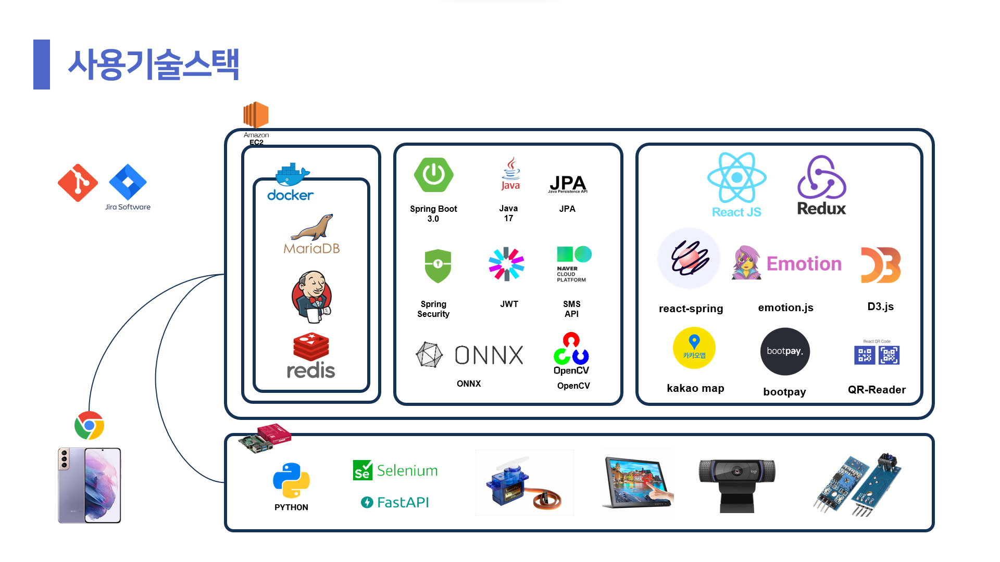

 

## 스크린샷

- <h5>우산 대여</h5>

| 대여버튼 터치 | QR코드 지점확인 | 카카오페이 결제 |
|:----:|:----:|:----:|
|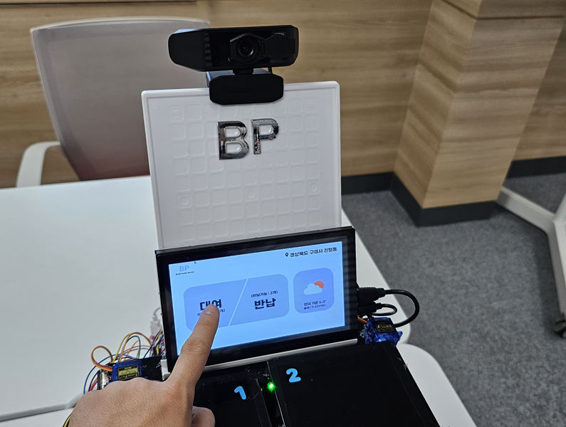|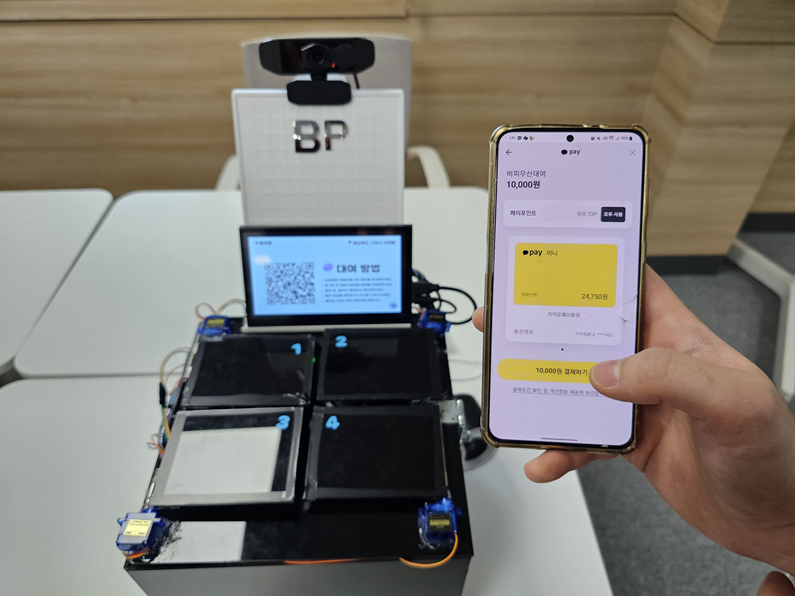|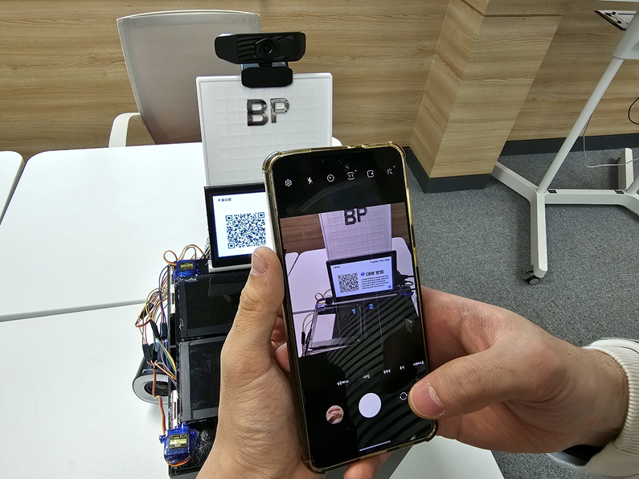|

 

- <h5>우산 반납</h5>

| 반납버튼 터치 | 우산 QR코드 확인 |
|:----:|:----:|
|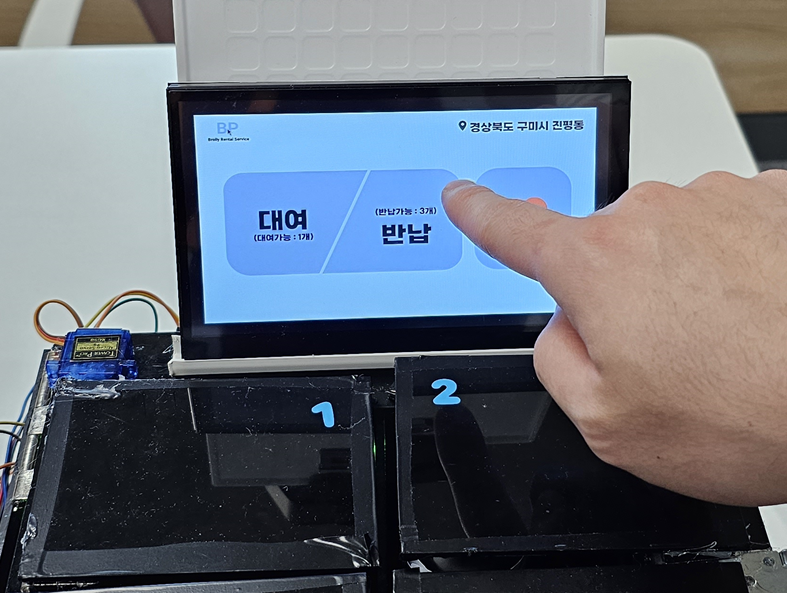|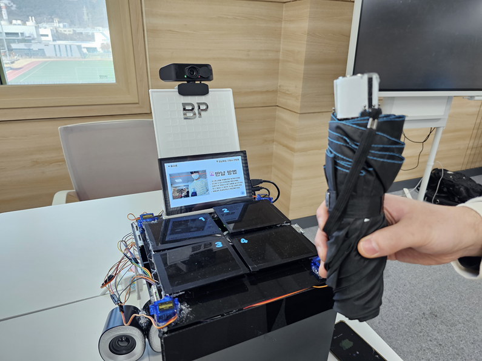|

| 우산 인식 (YOLOv5) | 반납 영수증 확인 |
|:----:|:----:|
|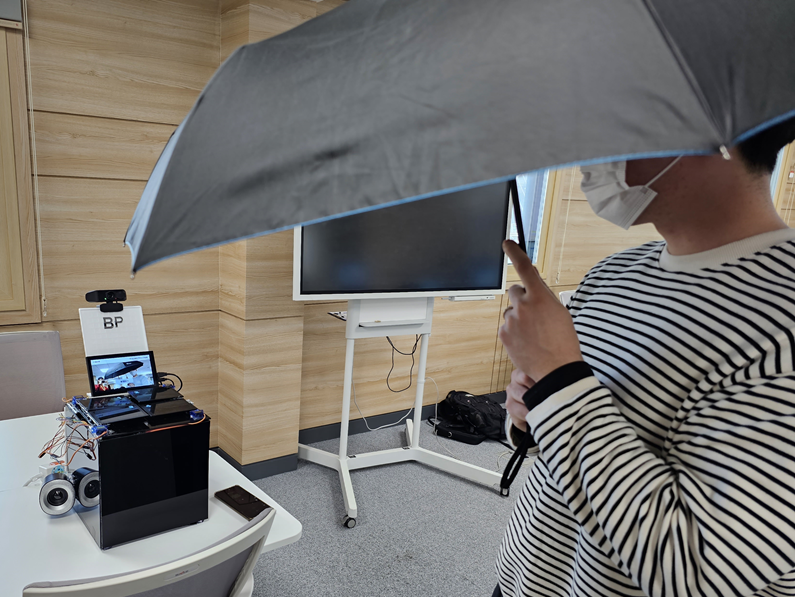|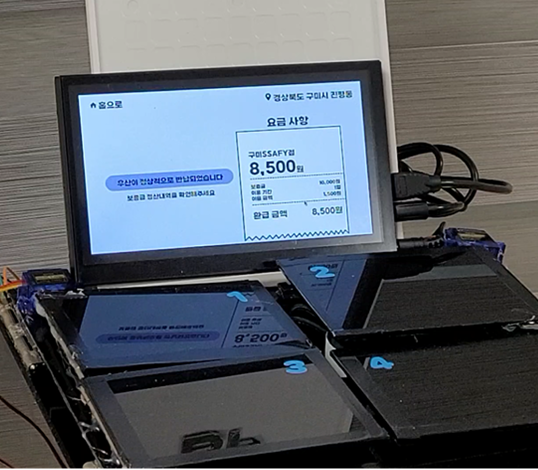|

 

- <h5>사용자 홈페이지</h5>

| 키오스크 위치조회 | 챗봇 문의 |
|:----:|:----:|
|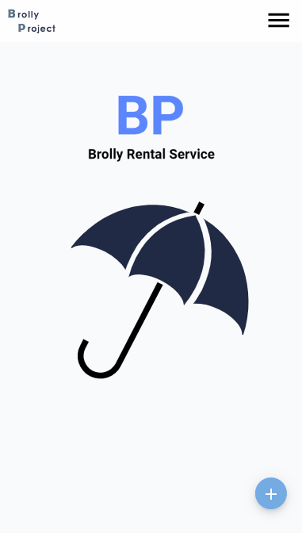||

| 우산대여 히스토리 | 홍보 메세지 |
|:----:|:----:|
|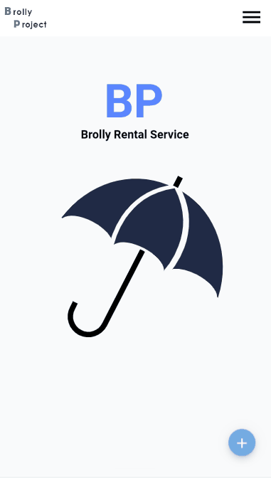|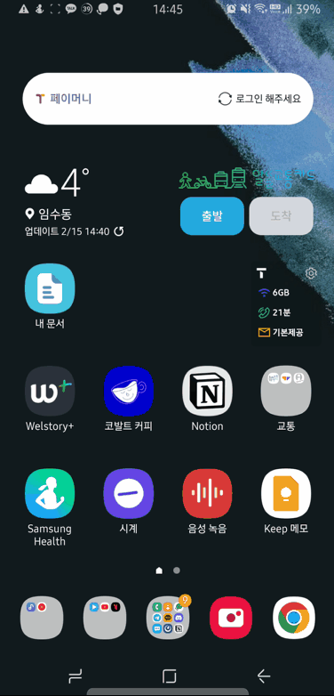|

 

- <h5>관리자 홈페이지</h5>

| 매출현황 조회 | 사용현황 조회 |
|:----:|:----:|
|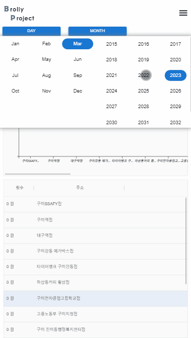|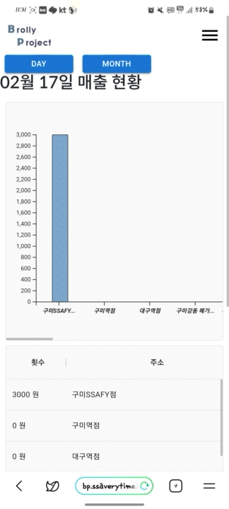|

| 사용자 목록 및 이용내역 | 키오스크 관리 |
|:----:|:----:|
|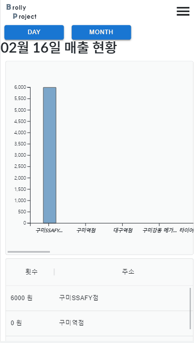||

 

 
