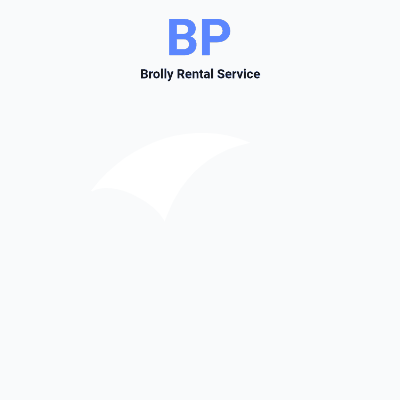

# 우산대여 프로젝트: 비피

 

## 프로젝트 소개
**우산대여 프로젝트: 비피**는 웹IoT 프로젝트로, 가상의 우산대여 시스템의 설계 및 구현, 키오스크 제작까지에 대해 어떤 기능이 필요할지 요구사항을 추려내고, 해당 요구사항에 따라 기능을 구현한 **개발진의 역량향상** 프로젝트입니다.

크게 웹 Front-end, Back-end, IoT 파트로 나누어, 7주동안 프로젝트를 진행했습니다.

- 2023.02.17. 삼성청년소프트웨어아카데미(SSAFY) 8기 2학기 공통프로젝트 구미캠퍼스 1반 1등

 

## 목차
- [참여자](#참여자)
- [발표자료](#발표자료)
- [기간](#기간)
- [기능구현](#기능구현)
- [라이브러리](#라이브러리리)
- [스크린샷](#스크린샷)

 

### Back-end

| 한재용([@rigizer](https://github.com/rigizer)) | 정명관([@rhalsemd](https://github.com/rhalsemd)) | 한상우([@miracle3070](https://github.com/miracle3070)) |
|:----:|:----:|:----:|
||||

 

### Front-end

| 이주형(@dlwngud9303) | 한승준(@tmdwns950428) | 김태헌(@ggnsall) |
|:----:|:----:|:----:|
||||

 
